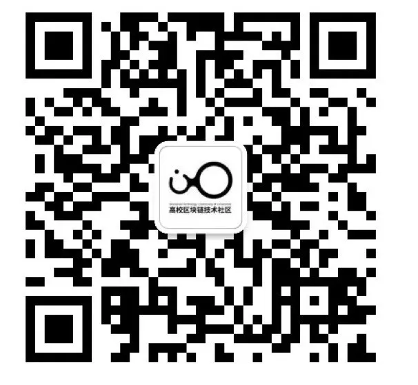

# 做区块链世界的村民 | 村民手账 Vol.0xxxxx

***

我们很喜欢区块链媒体制作的《预言家周报》。区块链世界不只有预言家发言，也需要更多的“村民”发言。

**村民手账** 为 `BTCU` 社区热爱学习的朋友们而准备。社区的学习者们会推荐自己最近阅读的优质文章，附上推荐理由。这一切的目的是为了督促自我学习并提倡分享精神。文章不对时效性作出限制，更注重入门者的学习效果。

如果你也想为 `BTCU` 社区的广大学生朋友们分享文章，或者想加入我们一起学习，可以联系 `BTCU` 社区小助手入群（下方扫码）。

如果你也感兴趣区块链世界的村民们在关心些什么，不妨关注村民手账。

***
30所高校区块链协会负责人联合发起  
汇聚高校区块链技术力量  

**扫码加小助手入交流群**

入群有KYC，仅对学生开放

企业合作请表明来意

