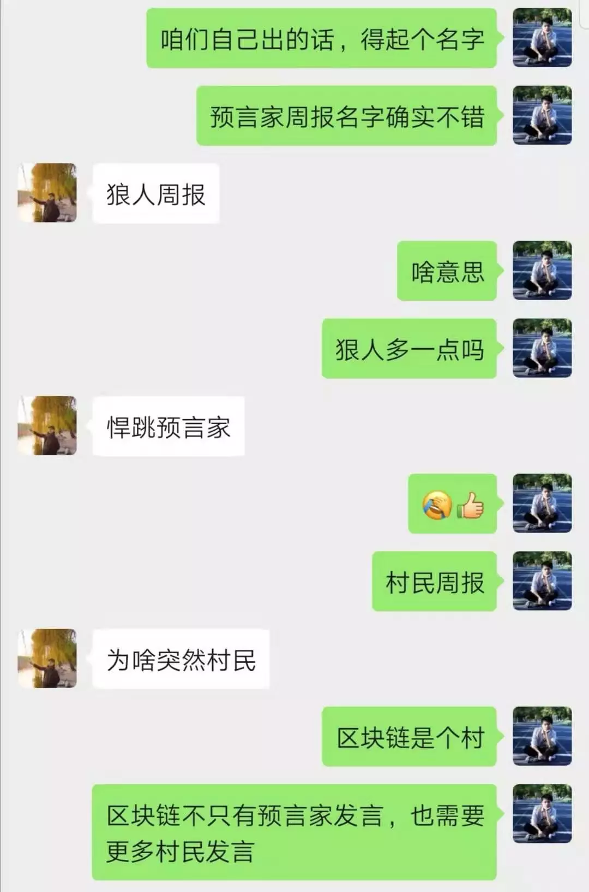

# 做区块链世界的村民 | 村民手账 Vol.01
BTCU 社区（高校区块链技术社区）还是一个小众的社区，如果以它的微信群成员来算，现在也才不过 800 人；如果把它包含的各高校官方学生协会或爱好者社区成员全算在内，恐怕满打满算也就 3000 人。

3000 人在充斥着各种社群的区块链圈里算不得多少人，但我对能有这样的规模感到很高兴，毕竟学生群体本来就不大，<u>整个清华一届学生也就 3000 人</u>。

**有 3000 名与我年龄相仿的同学同样对区块链充满兴趣，这让我兴奋。**

这种兴奋很明显是会传染的。从我们建立起微信大群以来，当终于有一个平台让来自全国天南海北的学生们聚集在一起时，当他们之前对于区块链 摸象式的探索、片段式的学习 在这个平台里得以融合的时候，群里弥漫着一股情绪，一股我接触区块链以来非常久违的情绪。

群里一个问题抛出来往往一上午就能争论好几百条，但你往上滑就能发现，参与讨论的不超过 10 个人，这对其他人来说是一个好的学习方式吗？我觉得不是。

微信群是一个交流的好地方，但不是学习的好地方。

更多的同学只是在一旁默默看着，大家都是聪明的学生，他们会扫过那几百条讨论，而把最初引发讨论的文章挑出来仔细地读，反复地读。

因此，当我说想在 `BTCU` 社区内建立一个文章分享小群的时候，立即得到了积极的响应。进群的同学必须积极学习、积极分享，不做白 piao 党，最终将人数严格控制在 20 人。

[橙皮书](https://orange.xyz/)一直是知识上喂养我的重要媒体之一，我很喜欢他们，甚至破例邀请了橙皮书团队一个小姐姐进群和同学们交流（BTCU社区成员全是学生）。因此我几乎在决定做文章分享的时候立即就想到了橙皮书的[《预言家周报》](https://orange.xyz/newsletter)。BTCU社区也应该做周报，小群内的精选分享一定要继续传播给 3000 名同学们。

我在小群里问，咱们如果出周报，有没有什么好名字：

我觉得从狼人杀的角度解读“预言家”非常新颖，虽然橙皮书是从哈利波特的角度解读的。但我很喜欢 “**村民**” 这样的定位。

> * 世界里有很多神位，希望他们可以指引村民正确的选择；
> * 在大部分时间漫长的白天里，村民们的发言也很重要；
> * 村民要保持智商在线，不要做一个愚民。

之前还有一篇讲述以太坊、Cosmos、波卡的文章，也用到了 **村民** 的形象：
>“ 当一个村庄构建出一套账本系统，他们会希望其他村庄的村民也能这样记账，最终保证所有村庄账本畅通，形成价值流动的世界。”

这套账本最终好不好用，还得村民用脚投票。

制造账本者努力地在精雕细琢，同时村民们也在天天上会计课。我们希望村民们把学习的知识、心得都记在同一个手账里。

我们不是面向全行业的周报，我们希望村民们能够学的开心。今日是 **村民手账  Vol.01**，下面是为 `BTCU` 的村民们推荐的精选文章：

## 1
***
**纽约客：加密大神眼中的区块链热潮与兴衰**  
https://mp.weixin.qq.com/s/ugjMLrZqWjsXa-Vj2S9ezA

@冯力全 北京邮电大学：

以幽默诙谐的口吻，从非技术角度科普了区块链（主要是以太坊）的一些历史。近两万字的文章一口气读下来却仍意犹未尽。里面对区块链先行者的描写，如：Vlad Zamfir，Vitalik Buterin 等，从他们的技术，生活方式，理念，你就会明白他们为什么会说价格是加密货币中最没意思的部分。还有对一些历史事件的回顾，包括 The DAO 事件，以太坊分叉等，能够让人对社区共识有更深刻的理解。

## 2
***
**比特币二十年后是什么样？**  

https://mp.weixin.qq.com/s/u9JHyT5q4OyZGF3zQcX4-g

@姚一帆 北京邮电大学

针对二十年后加密货币世界的预言。以技术迭代发展的历史观类比分析了区块链技术的潜在价值，也批判了当下许多人对于区块链技术的短视。提出了区块链泡沫破裂（预言已成现实）、政府主导加密货币的繁荣、公链协议层与加密货币结算层分离等多个维度的预言。文章极具前瞻性，诠释了了区块链技术背后蕴含的世界观。作者对于人类社会发展变革的思考也很有学习价值。

## 3
***
**DeFi精选：2019不可绕开的区块链话题**  

https://www.chainnews.com/articles/989152344636.htm?from=timeline&isappinstalled=0  

（链接请复制后在浏览器打开）

@Rudy卢地 清华大学

本文是一篇非常好的 `DeFi` 文章索引文，由区块链媒体链闻整理，会持续更新加入 `DeFi` 的优质文章，推荐收藏。

`DeFi` 和 `Staking`, `DAO` 是今年最火热的三大话题，大家始终在讨论与分析 `DeFi` 的发展与未来，但从目前来看，其除了借贷、稳定币、`DEX` (去中心化交易所)这三宝之外并没有其他的成熟应用场景。就我认为，如今的窘境很大程度上是因为数字货币的流通支付场景并不普及，可编程链上去中心化交易的功能性目前很大程度上受到了数字货币实际应用场景不足的制约。因此一方面让我们期待应用区块链技术、能编写智能合约的主权数字货币出现，一方面赶紧多看文章学习起来吧~

## 4
***
**姚前演讲全文：数字资产和数字金融**  

https://mp.weixin.qq.com/s/hh9Xznv70aIv742Avl0o1g

@张胜楠 中央财经大学

数字资产和数字货币是数字经济最重要的两个方面：在数字资产方面，任何的金融工具如货币、证券等均是罩在底层资产上的“一层面纱”，数字化使实体资产的确权和流转成为可能；在数字货币方面，私人部门和公共部门均在发力。

## 5
***
**肖风万向峰会闭幕演讲全文：由Libra引起的思考**  

https://mp.weixin.qq.com/s/AiTfzawWUAufyUCFJmws6g

@王业伟 上海交通大学

肖总在万向区块链周的闭幕演讲，主要介绍三个方面：货币、金融和企业。货币--数字货币的未来，金融--新一代的金融基础设施，企业--数字经济。

货币方面，分类了货币的发行，数字货币的发行，技术极客在现代社会起到了越来越重要的作用，肖总还给到了央行的数字货币一些建议；

金融视角，提到 `Libra` “新一代金融基础设施的三个方面”，提到支付系统的演变，证明为什么区块链和数字货币将作为新一代数字金融体系；

企业的角度，花了很多时间论述数字化技术的特点，论证区块链将改变商业模式、重构商业的底层逻辑，大篇幅的描绘了区块链技术下的世界，经济形态，其中，肖总从企业家的角度谈了股东利益最大化的衰落和社会福利最大化的兴起，区块链解决了激励相容的问题，社会福利最大化是我们社会的未来，区块链技术也是一个为了促成社会福利最大化的技术。

## 6
***
**FineGrained, Secure and Efficient Data Provenance on Blockchain Systems**  

https://pan.baidu.com/s/1WwNtpkDXRmbZwJ3e7ivf0Q  密码:2rkt  

或者从 `GitHub` 直接下载:  
[Fine-Grained, Secure and Efficient Data Provenance on Blockchain Systems.pdf](../files/Fine-Grained,&#32;Secure&#32;and&#32;Efficient&#32;Data&#32;Provenance&#32;on&#32;Blockchain&#32;Systems.pdf)

@李皓 武汉大学

我给大家分享一篇论文吧，看论文可能没有看推文那么让人兴奋，大多从小的点小的方面去做一些细节完善和优化，这篇实现的是一个区块链溯源系统，基于 `Hyperledger` 底层和 `ForkBase` 存储实现，特点在于利用 `Merkle DAG` 存储细粒度溯源信息和提出一种跳表索引结构来支持更高效的溯源检索。

## 7
***
**区块链开发权威指南**  

https://mp.weixin.qq.com/s/RDl6QD6b3DSj_MJqPF6wlA

@冯力全 北京邮电大学

这篇文章是一篇区块链开发入门指南。里面提到的资料、工具都很棒，配合 `Google` 食用风味更佳。我建议是指南包含的方面比较多，如果对某些方面不感兴趣或者觉得很难，可以先跳过。

***
***

我们很喜欢橙皮书和他们的《预言家周报》。区块链世界不只有预言家发言，也需要更多的“村民”发言。

**村民手账** 为 `BTCU` 社区热爱学习的朋友们而准备。社区的学习者们会推荐自己最近阅读的优质文章，附上推荐理由。这一切的目的是为了督促自我学习并提倡分享精神。文章不对时效性作出限制，更注重入门者的学习效果。

如果你也想为 `BTCU` 社区的广大学生朋友们分享文章，或者想加入我们一起学习，可以联系 `BTCU` 社区小助手入群（下方扫码）。

如果你也感兴趣区块链世界的村民们在关心些什么，不妨关注村民手账。

