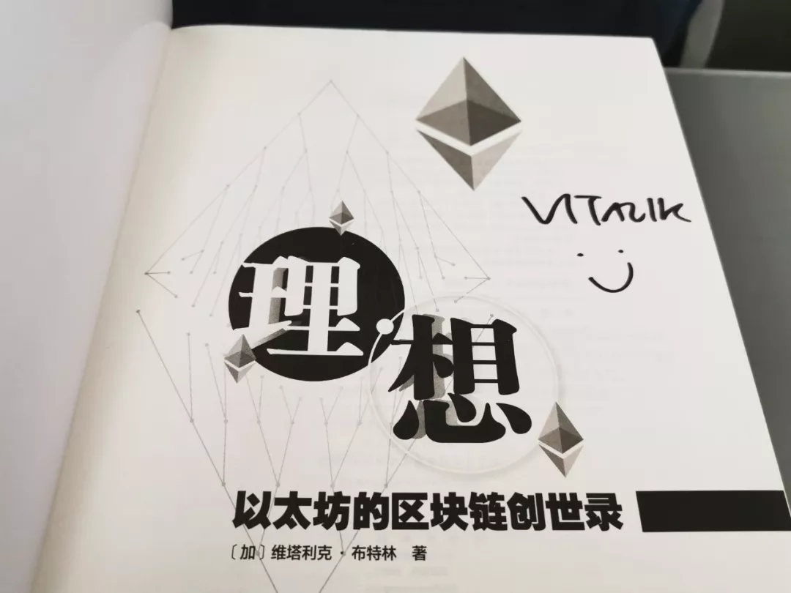

# 以太坊依然令人流连忘返 | 村民手账 Vol.02

本周对我来说是以太坊的一周。

假期到了，社区的大家大概忙着出门旅游，再则可能因为行业里的国内公司大部分也放假了，供讨论的话题素材感觉少了一半。

没有热点和工作打扰，刚好我也能有空捧着V神签名的《理想》好好地读了一周；另外ETH 2.0最近的讨论也越来越热，作为可见的未来里市值最大的 `PoS` 公链，事关 `staking` 大事，我自然也不会放过。

V神签名赠书《理想》，感谢Harmony创始人Stephen

想在网络上寻找以太坊2.0的解读资料，想来想去想到了Ethfans论坛，这个我可能初入区块链行业时就知道的论坛，现在打开倍感亲切。看了Ethfans的网站建设，我觉得BTCU真的还有很长一段路要走...Ethfans从2015年至今笔耕不缀，发表文章已过千数，涵盖范围也早已超过以太坊自身：区块链基本知识、行业热点、延伸解读无所不包，且建立了具备知识体系与学习路径的区块链知识库。

链接：https://ethfans.org/

那几天我又重拾了当年进入 `Ethfans` 的热情，如今的 `Ethfans` 依然令我流连忘返。

我看到 `staking` 行业的同行们最近也在研究 `ETH 2.0`，卡总就发朋友圈说：以太坊目前最伟大的地方就是有太多牛逼的人都在研究与讨论它。

无涯社区的 blockpunk 也是我们社区的活跃分子，总是在我们社区里和大家讨论的热火朝天。blockpunk发表观点总是旗帜鲜明令人印象深刻，他就直接说：我期待`ETH 2.0`，2.0 出来我（做的应用）立马切过去。

我相比他们步调还是慢了点。最近仔细研究了一下 `ETH 2.0`，我现在也非常认同他们的热情。

如今的以太坊，依然令我流连忘返。

感谢 `BTCU` 社区的小伙伴们放假期间依然不忘学习与分享，本周也为大家带来了一周的学习精读成果。今日是 村民手账 `Vol.02`，下面是为 `BTCU` 的村民们推荐的精选文章：

## 1
**读心术：从零知识证明中提取「知识」**

https://ethfans.org/posts/extract-knowledge-from-zkp-part-3

（链接请复制后在浏览器打开）

@姚一帆 北京邮电大学 ：

Vitalik Buterin 称零知识证明(`Zero knowledge proofs`)是以太坊“最为强大”的解决方案，未来的升级优化中，以太坊零知识证明的效率将得到大幅改善。那么，零知识证明究竟是什么呢？

作者用三个 `part` 分别解释了零知识、证明、模拟等概念。运用多个例子，由浅入深的描述了零知识证明的理论基础和技术实现。长文略烧脑，对于想要拓展区块链技术知识面的朋友，是一篇不容错过的好文章。

## 2

**`Web3` 思想简史——致真正的区块链创业者**
https://mp.weixin.qq.com/s/j25jWK2S8qJwDyfhdv1hCw

@冯力全 北京邮电大学

从开放社会到密码朋克运动，从比特币到以太坊再到 `Polkadot`，`Web3` 思想发展的脉络清晰可辨。通过这篇文章可以领略区块链思潮与技术的发展，以及对 `Web3` 的展望。

## 3

**支付与储值，哪条将是比特币未来的价值之路？**

https://www.chainnews.com/articles/653514690390.htm

（链接请复制后在浏览器打开）

@燕昕怡 中央财经大学

文章从经济学角度出发，围绕货币的三大功能，对 `BTC` 未来的价值之路做了一番探讨。

如同文中所说：在行业封闭的经济小周期中，`BTC` 的挖矿就像是商品社会中的黄金采掘，主流币种相当于由 `BTC` 衍生出的第一层价值资产，市场上众多的数字货币相当于商品社会中的生产商。商品可以奇货可居，可以无人问津，但黄金的最终支付能力的地位不会改变。同样，`BTC` 的价值储值工具之路也将走向光明的未来。

## 4

**`CCF` 区块链专委会斯雪明：区块链未来三年将在实体经济中广泛落地**

https://mp.weixin.qq.com/s/E0WwoiQiWXRXB-orl_S3Rg

@王业伟 上海交通大学

文章源自`CCF`专委会主任斯雪明教授在微众首届`Fintech Day`上的演讲。斯雪明主任从国内外区块链产业发展与趋势、国内区块链应用发展现状与趋势和对发展区块链产业与应用的思考三个方面谈论区块链产业与应用，给到了区块链行业方向和信心。斯主任的演讲直接使用到近几年行业发展的图表来展示区块链产业的现状，预测区块链产业的趋势，演讲内容论点论据分明，图表资源丰富，阅读这篇文章不仅仅可以了解到产业的现状和趋势、政策支持和研究现况等等，而且其中提到的一些内容极具说服力，可以引用到一些专业性文章中。

## 5

**一文读懂 `DeFi` 领域合成资产：基本概念、现有用例和未来机遇**

https://mp.weixin.qq.com/s/h69domVp1eV65Oo5rk-gFg

@王鑫 深圳大学

合成资产是一种复杂的金融工具，曾多次让全球经济陷入困境。同样，它们也可能以我们尚不了解的方式对协议安全构成风险。尽管如此，合成资产仍在传统金融市场发挥着重要作用，并正在成为 `DeFi` 运动的一个关键组成部分。

## 6

**德国区块链技术在金融科技领域中的应用、监管思路及对我国的启示**

https://pan.baidu.com/s/125iwd5BU_0WkbQchmnJcRg  密码:u6lx

（链接请复制后在浏览器打开）  

或者在 GitHub 上下载：  
[德国区块链技术在金融科技领域中的应用、监管思路及对我国的启示.pdf](../files/德国区块链技术在金融科技领域中的应用_监管思路及对我国的启示.pdf)

@梁作栋 哈尔滨工业大学深圳校区

德国是世界上首个承认比特币合法地位的国家。该国对金融科技在金融领域的相关应用一 直秉持开放态度，对于金融科技领域的监管也走在 了世界前列。作者在文中探讨了德国经济主体如何使用区块链进行金融创新，梳理了相关的成果，最后结合我国金融立法和监管实践，提出了相关政策建议。

***

我们很喜欢橙皮书和他们的《预言家周报》。区块链世界不只有预言家发言，也需要更多的“村民”发言。

**村民手账** 为 `BTCU` 社区热爱学习的朋友们而准备。社区的学习者们会推荐自己最近阅读的优质文章，附上推荐理由。这一切的目的是为了督促自我学习并提倡分享精神。文章不对时效性作出限制，更注重入门者的学习效果。

如果你也想为 `BTCU` 社区的广大学生朋友们分享文章，或者想加入我们一起学习，可以联系 `BTCU` 社区小助手入群（下方扫码）。

如果你也感兴趣区块链世界的村民们在关心些什么，不妨关注村民手账。

**村民手账** 为 `BTCU` 社区热爱学习的朋友们而准备。社区的学习者们会推荐自己最近阅读的优质文章，附上推荐理由。这一切的目的是为了督促自我学习并提倡分享精神。文章不对时效性作出限制，更注重入门者的学习效果。

如果你也想为 `BTCU` 社区的广大学生朋友们分享文章，或者想加入我们一起学习，可以联系 `BTCU` 社区小助手入群（下方扫码）。

如果你也感兴趣区块链世界的村民们在关心些什么，不妨关注村民手账。

**扫码加小助手入交流群**
