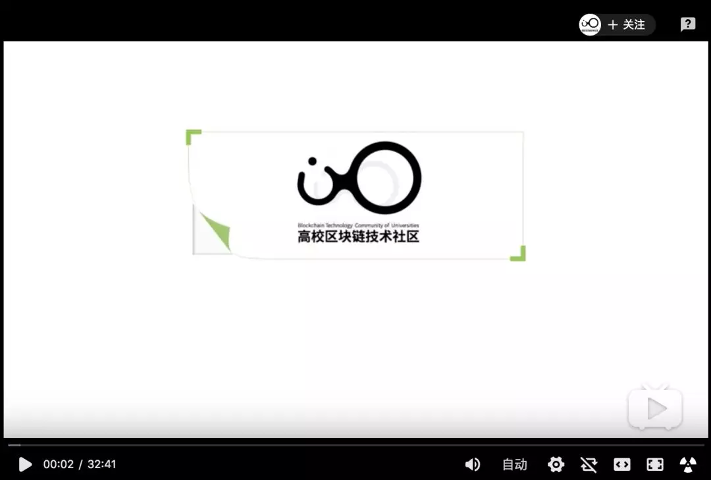

# 你喜欢听联盟链的故事吗 | 村民手账 Vol.04

上周是BTCU联盟链训练营开营第一周，我腆着脸混在一群技术大佬里讲了第一节绪论课，也可能是一部分学生唯一听起来没有困难的课。从我那节课后开始，全都是手把手编程课，辛苦了力全老师，一直在课程群里回答小白学生的各种问题。

我们的所有课程都发布在B站上，欢迎大家前往观看。这对付了费的同学们也没有不公平的地方，因为我觉得大家的主要付费点就是力全老师的手把手指导。

链接：https://space.bilibili.com/477534964?from=search&seid=4148645626889623281

有同学也许会奇怪，BTCU的课程体系为什么最先从联盟链开始。当然，我在上一期手账里解释过，BTCU的课程是分布式研发，由不同的团队双线并行，只不过联盟链课程的速度比较快，先做好就先面世了。

但我想，也许如果公链的课程先出来就不会有这种问题。想到区块链，绝大多数的大家总第一时间想到公链，第二时间可能才想到联盟链。

我估计这是因为公链可以讲的故事太多，完全开放的节点准入带来的是无需许可、去中心化、透明、社区自治等等概念，这些种种由于和现在的秩序差异较大而产生更大的想象空间。随之而来的又是受制于完全开放而造成的性能低下，低下没事，一批开发者绞尽脑汁思考如何能提升性能，另一批开发者绞尽脑汁思考如何用现在的低性能做应用，两拨人均兴致勃勃，媒体与群众们也摇旗呐喊，公链的故事流传也越来越广。

但是我们熟悉的大厂们，IBM、微众银行、蚂蚁金服、摩根大通、百度、京东、华为，其实早早入局了区块链，只不过是采用的联盟链形式。微众FISCO BCOS是与社区合作比较多的联盟链之一，与微众团队一聊才知道人家早已有了多达30多个场景下的落地应用，相比之下在公链上谈应用还远得很。

无视是Ignorance，无知也是。

推荐看看上周入场的“国家队”的白皮书——《区块链服务网络基础白皮书》，链接放在下面可自取。由国家信息中心、中国移动、中国银联等单位共同编写。

感谢BTCU社区的小伙伴们过去一周的学习分享，本周也为大家带来了一周量的学习精读成果。今日是 **村民手账 Vol.04**，下面是为BTCU的村民们推荐的精选文章：

## 1

**白皮书：《区块链服务网络基础白皮书》**

https://github.com/btcu-pro/Weekly-Report/tree/master/files

（进入目录后下载对应文件）

@梁作栋 哈尔滨工业大学深圳校区 & Rudy卢地 清华大学

> “公有链几无用武之地，联盟链各自为政，行业亟需公共基础设施”。

国家信息中心、中国移动、中国银联似计划推出建立各方认可的公共基础设施网络，将基于联盟链技术，提供可以低成本开发、部署、运维、互通和监管联盟链应用的公共基础设施网络。

## 2

**以太坊2.0漫谈：ETH 与 BETH 之间的纠葛**

https://www.odaily.com/post/5141700
（链接请复制后在浏览器打开）

@燕昕怡 中央财经大学

Eth2.0的最后准备工作正在完成，Eth2.0的上线是否会带来两种不同价格的加密资产？在Devcon5的讨论中认为：Eth2.0会是一条新链，一个新的代币体系。而当前采用 PoW 机制的 Eth1.0 链依旧会继续运行至少三年的时间，这意味着新旧两条链会在未来几年同时运行。双链并行，Eth1.0链和Eth2.0将如何实现通信，交易所是否会上架两种不同的以太坊代币，个体用户又会如何选择？

## 3

**2600万TRX被盗背后的罗生门**

https://mp.weixin.qq.com/s/aInEaYdS9X7HP7FbzWl6AQ

@冯力全 北京邮电大学

此次TronBank合约被盗事件再次印证了一个简单到令人发指的常识——所谓智能合约的开源并不能等同于“无条件的安全”，而且粗糙的去中心化机制可能存在被利用的中心化黑幕可能。在目前这个混沌无序的市场环境中，作为一个成熟的“韭菜”，请不要再轻易相信任何口头上的去中心化承诺。

## 4

**邹传伟：区块链的经济学和监管问题**

https://www.chainnews.com/articles/949600236690.htm

（链接请复制后在浏览器打开）

@王业伟 上海交通大学

这篇文章是来自于邹传伟博士在上海交通大学高级金融学院做分享的演讲稿，演讲立足于区块链的金融和监管，主要是五个方面的内容：token范式、区块链应用分类、金融基础设施、libra 的风险与监管和全球区块链监管的问题，邹董的演讲针对性的全面的介绍了token的概念，基于token的经济功能对区块链应用进行分类，演讲还对数字货币和第三方支付进行了比较，而对libra 的风险和监管、区块链的全球监管，在7月份就提出了libra的监管和风险，预测了所将带来的结局，强调了监管问题对区块链的重要性，提出了监管的导致的ICO普遍存在的问题和应对的监管措施。

## 5

**曾经的区块链十大天王项目，还剩几个？**

https://www.theblockbeats.com/news/3959

（链接请复制后在浏览器打开）

@Rudy卢地 清华大学

每一代总有所谓“天王”项目，明星团队、明星概念、明星方向，但最终是否可以落地依然未知，昔日明星无人问津，信仰拥簇者成为维权讨债者，代币与项目脱钩成为庄家操盘的大赌场，但也许行业最早期永远需要这样的先行者们，为行业试错，最终趟出可行的路。

## 6

**公链抱紧USDT大腿**

https://mp.weixin.qq.com/s/2FRGamg83qw1-gdDGtdlrw

@Rudy卢地 清华大学

500万枚EOS-USDT属于在EOS上直接增发，而不是将对应omini版本USDT销毁，其背后是否存入等量的美金令人生疑，Tether中心化印钱的现象，没有因越来越多的去中心化稳定币的出现而受到遏制，反而让各公链争相追捧，其他公链究竟是像ETH一样发展自己的DeFi来发展稳定币，还是继续追逐发行自己版本的USDT？

***

我们很喜欢区块链媒体制作的《预言家周报》。区块链世界不只有预言家发言，也需要更多的“村民”发言。

**村民手账** 为 `BTCU` 社区热爱学习的朋友们而准备。社区的学习者们会推荐自己最近阅读的优质文章，附上推荐理由。这一切的目的是为了督促自我学习并提倡分享精神。文章不对时效性作出限制，更注重入门者的学习效果。

如果你也想为 `BTCU` 社区的广大学生朋友们分享文章，或者想加入我们一起学习，可以联系 `BTCU` 社区小助手入群（下方扫码）。

如果你也感兴趣区块链世界的村民们在关心些什么，不妨关注村民手账。

