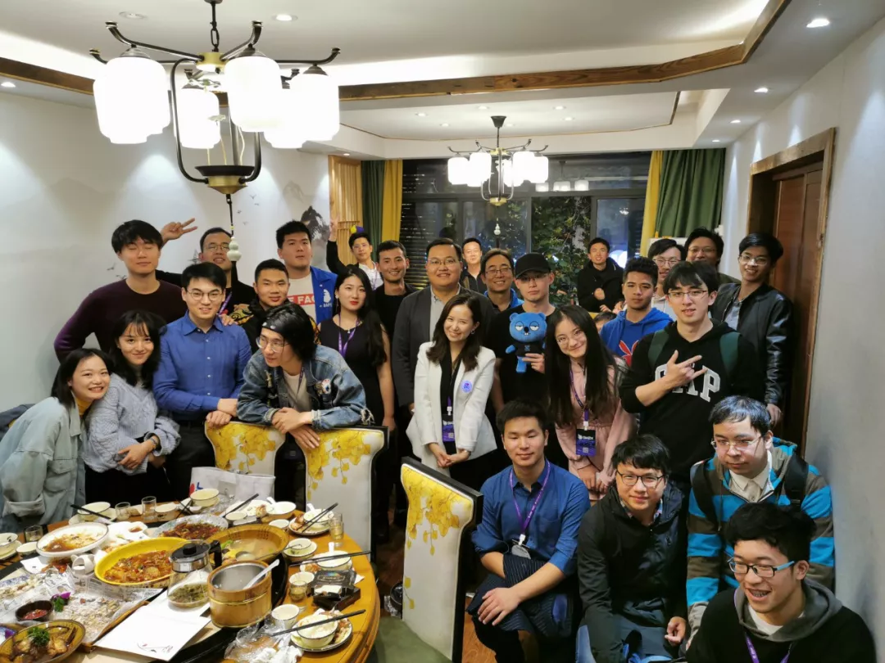

# 建设社区如此困难，何谈归还社区？| 村民手账 Vol.07

*图：各协会伙伴乌镇活动后小聚*

上周末BTCU社区拉了200多名学生齐聚乌镇，感谢巴比特赏了这么多票，还提供了200人一下午的场地让我们欢聚。关于活动的话不多说了，上一篇推送已经写得很明白了。  

[年龄最小、最有才华、被称为区块链的未来：BTCU社区于乌镇世界区块链大会霸气包场](https://mp.weixin.qq.com/s/o4Q9US-Nl26s7gHhLDnPXw)

比较想扯开写一写的是上周末就在乌镇时看到的另一条新闻。某个国内公链项目方宣布将项目归还社区，三名联合创始人和半数员工均已离开。  

可能还有同学不懂“归还社区”的意思，这是区块链世界里近似于乌托邦的理想，纯靠社区自治来驱动项目发展，弱化公司、单个团队或个人在一个项目中的主导作用，达到近似去中心化、泛中心化发展的目的。其理念近似于为开源项目贡献代码，为维基百科修改词条，而希望通过区块链通证经济、链上治理、DAO的帮助下来实现更大规模的去中心化协作。  

该项目不是提出“归还社区”的第一个，很多已经给出了归还社区比较“成熟”的模板：1. 成立委员会，职能是审核社区提交的提案；2. 基金会划拨一笔Token用于支持通过的提案，其之前1C0时白皮书中所写用于“生态激励”的Token部分刚好派上用场；3. 发公告，从此团队大隐隐于社区，再无项目方，大家都是社区好伙伴。  

其实如果真能做到社区统一规则、自发贡献，无论项目方成员还是社区成员大家按劳分配、按贡献拿币，这无疑是一个非常值得探索的协作组织模式，但关键在于几项条件是非常必须的。

1. **足够优质的社区成员储备**  
没有足够的开发者，谁来贡献代码？大部分公链项目都致力于扩充区块链开发者的储备（当然之前很大程度上是培养DApp开发方向的，不同时期不同需求），往往为此付出相当大的补贴力度，但少有项目见到规模，看一看谁家办的起DevCon就可以了。大部分项目方的社区是怎样的呢？我因为从事矿池业务进入过特别多公链的社区，活跃者全部是只关心币价的币民。当然，除了开发者外的其他能力者也是公链项目方发展一定需要的，但显然目前大部分项目的社区没有这样的培养意识。  

1. **明确的发展方向**  
生态强大如以太坊也需要知名团队牵头lead项目开发，如ETH2.0的Casper由V神和Vlad各自引领一支团队分别开发FFG和CBC。若社区KOL开发者未培养起来，创始团队解散，无人指引项目发展方向，也提不出来技术创新。参考下另一个“归还社区”的项目的提案网站就可以发现，几乎所有提案都是活动、宣传、合作类，开发类极少极少。

3. **社区自治理规则**  
如果社区内提出不同的发展意见，谁来批准，谁有权力，谁赋予他们权力？链上治理规则不做好，最终会结束于中心化或一盘散沙，社区心灰意冷之下只会用脚投票。而治理规则实际是非常难的，投票选超级节点那一套在EOS里已被诟病无数，如果再扩大化到整个社区的维护，一定漏洞百出，要么发展停滞不前，要么被薅走无数羊毛。  

上述只是软条件，硬条件还需要与之相配的足够好用的工具。就自己社区维护的经验来看，建设社区何其难，对于目前的现状来看，归还社区只可能是天真的借口。  

而对于BTCU社区而言，1、2已经成雏形了，好好探索一下3吧。

本篇是 **村民手账 Vol.07**，下面是为BTCU的村民们推荐的精选文章。如果你也想加入我们一起学习，欢迎在文末添加社区小助手入群。

## 1

**2018年中国区块链产业白皮书（工信部出版）**

https://github.com/btcu-pro/Weekly-Report/tree/master/files

（复制到浏览器后打开）

@张胜楠 中央财经大学

这份2018年5月工信部的《2018年中国区块链产业白皮书》太值得收藏+反复翻看，里面的产业痛点、为什么要用区块链、怎么用、实例效果如何写得一清二楚，也许里面的案例并不是最新的，但2019年的新案例大都依然是在本份白皮书的思路框架里。

前几天，华为任总提到量子计算对区块链加密的冲击，工信部这份白皮书里已然提到了如何应对量子技术，策略一：采用抗量子计算密码；策略二：采用量子密钥。

## 2

**实锤！中国自己的数字货币DCEP！**
https://mp.weixin.qq.com/s/KnUpAoNYWRxhwYGlSPQZoA

@姚一帆 北京邮电大学

随着DCEP的推出，我们意识到数字货币的变革真正来临了。但对于大多数人来说，感受到的可能只是多了一个电子化的钱包，原本支付宝里的数字金额好像流入了另一个自己管理的地方。但DCEP的意义与带来的冲击远不只此。一文带你深入理解DCEP，知道其何以成为货币界的原子弹。

## 3

**科普 | 以太坊上的隐私保护技术**

https://mp.weixin.qq.com/s/rMhjkcOKo4FyBHGEOY9tCg

@梁作栋 哈尔滨工业大学深圳校区

本文是一篇科普文，旨在介绍区块链上的隐私保护方案。作者简单地研究公有链上实际的隐私需求，并在抽象层面上探讨实行隐私解决方案的权衡，研究了各种实现企业和用户隐私的方式。

通过提出"隐私的重要程度"、"隐私是否是伪需求"、"隐私权衡三个问题"，详细地介绍了以太坊上的隐私方案和其他主打隐私型区块链（Monero、Zcash）的隐私保护技术。通过阅读本文，读者能够梳理目前主流的隐私保护技术，对区块链的隐私保护有清晰的认识。

## 4

**区块链逆袭时刻的冷思考**

https://mp.weixin.qq.com/s/e31xBk0pYoMzdSJX82XGyA

@燕昕怡 中央财经大学

区块链从充满争议的行业突然“逆袭”为国家战略，成为行业备受关注和追捧的焦点。然而聚光灯下更需要冷静的思考，三位对话者围绕“国家提倡的区块链是什么”，“国家想用区块链来做什么”，“将区块链提升为国家战略的好处”以及机遇和技术方向进行了深度思考，探讨了国家发展区块链战略的核心目标和意图，为区块链从业者和技术爱好者指明了一定的方向。

## 5

**Libra到了“最危险的时刻”？谁能救小扎？**

https://mp.weixin.qq.com/s/k6BL0bbUorvhrn9tkcHlNQ

@张胜楠 中央财经大学

Libra是要生产和管理一个跨全球的、跨主权的货币，它发起于技术极客思维却又在监管体系中，向左走是类似于完全去中心化的比特币，向右走是完全在监管下的主权货币，可以说它的灵魂想向左走但身体还在右边，相比之下，DCEP是要实现一个非常有限的目标，就是取代最后流通货币中5%的硬币纸币。

## 6

**Is Bitcoin really un-tethered ?**

https://papers.ssrn.com/sol3/papers.cfm?abstract_id=3195066

（复制到浏览器后打开）

@范家良 北京航空航天大学

从投资者角度简单来讲，文章找到了影响2017年比特币币价的大庄，大庄通过USDT增发，赎回等影响币价。从学术来讲，文章提出了一种结合数据挖掘和金融学的方法框架，来发掘数字货币交易市场的不端行为。

文章分析了在2017年年末比特币价格大幅上涨的过程中，Tether (USDT) 是否影响了比特币和其他数字货币的价格。文章使用算法分析区块链数据发现在市场低迷之后定时进行Tether的购买，并导致比特币价格大幅上涨。资金流都流向于一个实体，并通过算法发现月底前的Tether储备金不足。这些现象表明Tether增发不是需求驱动，而是供给驱动的。

## 7

**播客：和 Parity 的唐威聊聊区块链编程**

https://forkit.fm/9

（复制到浏览器后打开）

@冯力全 北京邮电大学

这期播客由 Polkadot 工程师唐威分享他的观点经历，包括：区块链项目里面选择 Rust 还是 Go 的考量；EVM 和 WebAssembly, RISC-V 实现的 VM 各有什么优劣；以及 ETC 目前社区发展和工作情况；还有以太坊 2.0 目前大概是什么阶段、libp2p 是否 over research 了、唐威自身的开发经历等等。全程充满干货，很能引起工程师的共鸣。

***
我们很喜欢区块链媒体制作的《预言家周报》。区块链世界不只有预言家发言，也需要更多的“村民”发言。

**村民手账** 为 `BTCU` 社区热爱学习的朋友们而准备。社区的学习者们会推荐自己最近阅读的优质文章，附上推荐理由。这一切的目的是为了督促自我学习并提倡分享精神。文章不对时效性作出限制，更注重入门者的学习效果。

如果你也想为 `BTCU` 社区的广大学生朋友们分享文章，或者想加入我们一起学习，可以联系 `BTCU` 社区小助手入群（下方扫码）。

如果你也感兴趣区块链世界的村民们在关心些什么，不妨关注村民手账。

