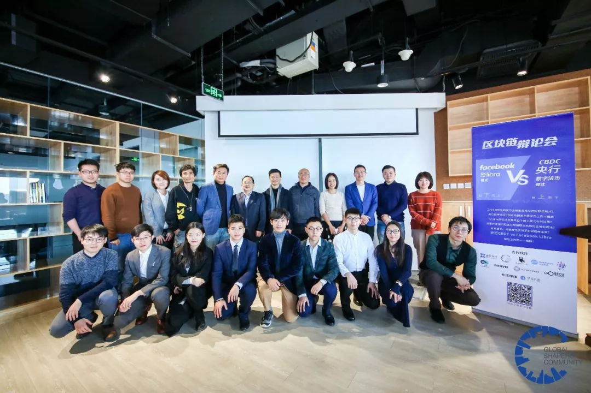

# Libra vs CBDC，技术进步为货币带来哪些改变？ | 村民手账 Vol.09

今天聊一聊Libra和CBDC（央行数字货币）两种数字货币。

周日打了一场很有意思的辩论，数字货币是Libra自下而上模式好还是CBDC自上而下模式好。辩论赛由达沃斯青年社区组织，BTCU社区出了6名辩手，与另外两位辩手一起分散在两个持方，激辩了两小时。结果不论，在准备与碰撞的过程中大家对于数字货币的本质、价值、未来可能形态都有了更深刻的认识。

基于区块链的数字货币有什么用呢？首先的好处当然是电子化并且可以提供可信编程，这将避免大量的审计工作，极大地降低中间成本，将衍生出丰富的生态。但是以DCEP为代表的央行数字货币目前定位于M0，目的是取代实际生活中的纸币硬币，相当于在支付宝之外提供了另一种可控匿名的选择。央行数字货币是不冲突现有货币体系、可执行可落地程度最高的数字货币类型。

而Libra是一种锚定一揽子货币的资产组合。在我们的讨论中，未来Libra协会很大概率会逐渐将篮子中的美元、欧元等货币换成国债、黄金、房地产基金等保值资产，越来越趋同于央行的资产组合。这时Libra将更符合我们一般认为“货币是央行的负债”的形式定义。

所以Libra是一个资产组合，这个资产可能是美元，也可能是国债、股票、房地产。这样听上去Libra更像是一种基金。大家不妨开阔一下思维，假使一家接受监管的持牌基金公司发行的基金，募资购买的是低风险资产，基金价格非常稳健，这样的基金是否可以用来日常支付呢？有的同学可能说不行，基金怎么做货币呢？其实国际机构结算外汇头寸可以直接用国债，绕过美元、人民币这样的我们传统认知的货币范畴，所以能否作为货币其实就看2点：1，它的价值稳定，2，你的交易对手方也能使用它。

有的同学可能说还是不行，基金没有办法支付呀？但那是因为之前的数据库结构，基金交易都是场内撮合交易，假使基金都采用的是形如Libra一般的结构，用区块链打通开放式数据库，交易不再是场内撮合而是点对点交易，收发、存储门槛都极低，是不是可以打通我们现在占资产比例可能20%~50%的理财产品，让他们都具有流动性变成点对点支付工具？

所以换个角度理解Libra类自下而上的数字货币，它是技术进步后自然衍生出的广义货币，这种不难理解的模式将催生出更多自下而上的产品创造来丰富我们的支付工具，这是一种真正由技术进步驱动的普惠金融。

还有一个辩论中出现的我非常喜欢的观点。有多少人懂得央行的货币发行机制？不太懂，但我们总寄希望于上层机构会懂，他们会做出最正确的决策，但是无数小国货币贬值的教训已经证明了它不是不会犯错。很多人说发行货币不是非政府机构能做的事情，但是航空航天领域也一度垄断在航天局手中，现在由于技术的进步也冒出了SpaceX等商业机构也推动了很好的发展。货币也本不该如此的难懂，技术的进步可以打破知识的垄断，这让我们认知货币的门槛更低，犯错的几率也更小。

本篇是 **村民手账 Vol.09**，下面是为BTCU的村民们推荐的精选文章。如果你也想加入我们一起学习，欢迎在文末添加社区小助手入群。

## 1

**全球稳定币与央行组织货币**

https://mp.weixin.qq.com/s/f5PWvx0DQsQ1m2-PcxpdMg

@姚一帆 北京邮电大学

人类对于组织管理的探索历程比远古冰山的存在时间更久远，此话不假。区块链技术为我们带来了变革传统货币的契机，DCEP和Libra，引出了对货币自上而下与自下而上两种治理模式的思考。当我们试图去寻求何者更优的时候，却挖掘出了更深邃的问题，从社会到哲学，经济到政治……推荐此文，望技术切面的些许认知与思考能引发大家对货币本质与演进更深入的探索。

## 2

**稳定数字货币手册**

Alpha版：

https://mp.weixin.qq.com/s/rk-omEw3PeOCRrONVVWCuA

Endgame:

https://mp.weixin.qq.com/s/3i5shSGGsP37wbvaXBFKOQ

Beta Version:

https://mp.weixin.qq.com/s/RVyx6l3OrCuZUgaGiJnHpQ

@Zeno 上海大学

DeFi在2019年迎来高光时刻锁仓额200%的增长，一夜间成为以太坊的核心故事。而问题也依旧严重，defi的概念混乱，意识形态化严重，代码安全与 抵押资产流动性的结构性风险。DeFi会是一地鸡毛？能够对金融带来什么？

阅读Mikko的稳定币三部曲，回顾我们到底想要什么。

## 3

**中国区块链投融资普查报告：融资金额仅美国四分之一， 数字资产相关领域最受欢迎**

https://www.8btc.com/article/521202

（复制到浏览器打开）

@Angelica 

关于区块链投融资情况的论文，推荐。

## 4

**On the Instability of Bitcoin Without the Block Reward**

https://github.com/btcu-pro/Weekly-Report/tree/master/files

（复制到浏览器打开）

@张奥 清华大学

比特币中的矿工激励分为区块奖励和交易费奖励两部分，通过每2016个区块（约4年）将区块奖励递减的方式逐步转为完全依靠交易费奖励。本文提出当激励完全转为交易费奖励后，分叉攻击和自私攻击将变得更有利益。

## 5

**中国人民银行研究局-区块链能做什么、不能做什么？**

https://github.com/btcu-pro/Weekly-Report/tree/master/files

（复制到浏览器打开）

@Zeno 上海大学

2018年11月央行对区块链技术的研究论文，清楚标明了区块链能做什么、不能做什么，建议一读。

## 6

**乌镇·PlatON创始人孙立林：隐私计算时代，“数据共享”是个暧昧的词**

https://www.8btc.com/article/509808from=groupmessage&isappinstalled=0

（复制到浏览器打开）

@王业伟 上海交通大学

 

同意的计算，区块链的本质就是一个基础设施，公共选择的基础设施。孙总对区块链的阐述有独到的见解，孙总的演讲从几个方面批判性的分析了区块链与隐私计算，每一个点都切中肯綮，独到深刻。演讲内容还涉及到了数字化时代的基本矛盾，提出一个概念--超级清算网络，给出一个范式--数字经济基础设施体系。我最喜欢其中孙总讲的两句话，一个是关于区块链有什么用的答案，另一个是一个愿景，用统一的计算把数字化世界建成真正的理想国。

***

我们很喜欢区块链媒体制作的《预言家周报》。区块链世界不只有预言家发言，也需要更多的“村民”发言。

**村民手账** 为 `BTCU` 社区热爱学习的朋友们而准备。社区的学习者们会推荐自己最近阅读的优质文章，附上推荐理由。这一切的目的是为了督促自我学习并提倡分享精神。文章不对时效性作出限制，更注重入门者的学习效果。

如果你也想为 `BTCU` 社区的广大学生朋友们分享文章，或者想加入我们一起学习，可以联系 `BTCU` 社区小助手入群（下方扫码）。

如果你也感兴趣区块链世界的村民们在关心些什么，不妨关注村民手账。

***
30所高校区块链协会负责人联合发起  
汇聚高校区块链技术力量  

**扫码加小助手入交流群**

入群有KYC，仅对学生开放

企业合作请表明来意

