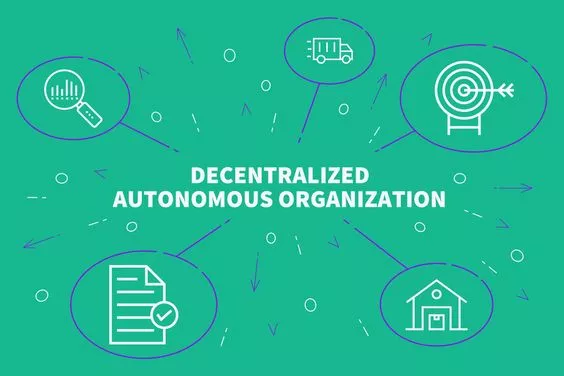
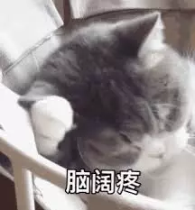

# DAO可道，非常DAO | 村民手账 Vol.10

BTCU其实一直有考虑是否将DAO作为未来的方向，所以一直以来也都非常关注DAO这个概念，以及它的发展。

说到这里可能有些同学还不知道什么是DAO ...

不会没关系，做手账的目的就在于此，就是为了帮助大家更好地学习。

最近大家应该都看过 “出身985、上班996、辞职251、维权404”的段子。因为最近又出了不少热点新闻。

暂且不论某些公司实际的对错，但大众对于大企业的普遍不信任感我们已经深切的感受到了。因为在中心化的权力关系构筑起来的组织里，组织与个人就是不平等的，人们总寄希望于“他们不会作恶”，或者寄希望于公司的文化、价值观，但是“寄希望”并不是一种强有力的约束方式。

而DAO(Decentralized Autonomous Organization)，也即“**去中心化自治组织**”，就是在寻找一种能够依靠透明、不能轻易篡改、依照代码自动运行的规则，来组织人们的活动与协作，这样的新型组织模式。

***

「一种组织形式，它通过以多边方式达成一致的先验约束，形式化和透明的规则来协调成员的工作和资源。」

——币安研究院对DAO的定义

***

币安研究院对DAO的定义稍微艰涩一点，但其实细品很有道理，原文贴在今天的手账推荐文章中了，建议大家阅读（不过是粗糙的谷歌英译中，阅读体验不佳），一并还有另外3篇，从1~4的顺序应该可以帮助大家更好地认识DAO。

首先谈一谈DAO和区块链的关系，为何区块链技术出现后DAO的话题变得如此火热。

道理很简单，区块链就是解决了去中心化多方个体之间的协同问题，运行在区块链上的代码最符合形式化、透明、不可随意篡改的特性。举个实际的例子来帮助大家理解DAO，那就是大名鼎鼎的The DAO，它通过写好在以太坊上的智能合约成立了一个去中心化基金，任何人可以投入资金并占有对应比例的投票权与收益，投票决定基金投资什么项目，并获得长期回报。在这个组织中，没有中心的组织者，仅靠事先约定好的规则来组织大范围却又彼此平等的个体，起到协作的作用。

DAO其实是一个非常终极的理想，想要同时实现“D”和“A”其实非常难，在现在的技术条件和可用工具，完全以代码实现且同时实现“D”和“A”的DAO基本只能用于投票治理，分配资金等极为限定的应用场景。同样举个很简单的例子大家就明白目前DAO的局限了，我们如果想去中心化地协作写一本书，难以对各人贡献的质量作客观评判，难以将书本卖出的收入做完全去中心化的分配，因为它们都不在区块链上！

所以现在我们看到的很多DAO，要么功能比较局限，要么只是蹭一下DAO的概念，实际其实应该算“DO”，也即只有“分布式”，没有完全的“自运行”，做不到“A”。这么说起来，现在我们在做的 `村民手账` 还有 `BTCU TALK` ，其实都是DO的一种，大家群策群力地分享文章或者直播一些区块链不同方面的认知。

但其实这就是趋势的开始。我们看比特币经过十年的发展，我们逐渐开始接受它作为一种认可度很高的投资资产，我们和新生事物的关系总是在不断改变的，身处这个变化的过程里，可能每时每刻感受到的都不显著，但如果若干年后回头看，你会发现它已经深入我们的社会与生活。

今日是 **村民手账 Vol.10**，前4篇均有关DAO，希望大家学的开心~

## 1

**什么是DAO？**

https://mp.weixin.qq.com/s/Xm32GKnn_SQ3b5ZIU6JUkA

@Rudy卢地 清华大学

作为区块链世界令人最兴奋的概念之一，DAO引发了不少人的关注。本文是对DAO的一个基础性介绍，包括DAO的基本认知、特点、目前主要案例。

## 2

**去中心化自治组织：发展现状、分析框架与未来趋势**

https://github.com/btcu-pro/Weekly-Report/tree/master/files/Vol.10
（复制到浏览器打开）

@阿蒙 北京邮电大学

该论文认为分布式自治并非新概念，自然界中的自组织现象、互联网上的动态网民群体组织以及分布式人工智能等均可视作其早期表现形式，而区块链技术的快速发展催生了去中心化自治组织(DAO)，使之有望成为应对不确定、多样、复杂环境的一种新型有效组织。该论文对 DAO 的概念及特征做出清晰界定;接着首 次系统地提出 DAO 五层分析框架，并以此为基础对典型的 DAO 应用案例——Aragon 做了详尽分析;之后讨论 DAO 目前所面临的问题和下一步可能的研究方向。

## 3

**币安研究院：DAO的理论与实践**

https://www.theblockbeats.com/news/6292（复制到浏览器打开）

@阿蒙  北京邮电大学

该研究将 DAO 定义为一种通过以多边方式达成一致的先验约束的组织形式，以形式化和透明的规则来协调成员的工作和资源。并对多边协议、资源管理、讨论和投票过程四个 DAO 的主要要素进行探索。

## 4

**龚焱：DAO与联盟链：一场始于哈耶克和凯恩斯的争论|互联网金融**

https://mp.weixin.qq.com/s/IInsM1nDJ81e0DBdCe3KCg

@张胜楠 中央财经大学

比特币区块链，可被视为第一个准DAO。每个矿工通过对区块的生成而获得奖励，每个节点对新生成的区块进行验证。而真正让DAO得以发扬光大的，要属以太坊。作为一个开源的、基于区块链技术的分布式平台，以太坊是当今第一大公链。因此，DAO组织可以通过以太坊来构建去中心化应用，并将组织的规则以智能合约的形式编码在区块链上，实现分布式自治性管理。

## 5

**中国金融稳定报告**

https://github.com/btcu-pro/Weekly-Report/tree/master/files/Vol.10

（复制到浏览器打开）

@钱家彦 中国科学院大学

区块链的一个很重要的应用场景是金融，中国金融稳定报告有关金融科技和监管科技的阐述和监管方面的阐述和建议，为区块链技术在金融领域的应用提供了一个合规的方向。

## 6

**公益加区块链落地了哪些？**

https://github.com/btcu-pro/Weekly-Report/tree/master/files/Vol.10
（复制到浏览器打开）

@叶新蕾 河海大学

最近水滴事件真的热，据说他们如果处理不了，就要捐给公益组织了～区块链与公益组织到底可以怎么样结合呢？这里面有。

## 7

***观点*** 

**17万个以太坊和40万个ENS域名**

https://mp.weixin.qq.com/s/zbASDZ-oY7ahLc4k7-Sn4Q

@安仔 北京邮电大学

介绍了ens上线以来的进展，从区块链项目和“new gTLD”域名两个维度比较了.eth 后缀取得成果。最后提到了一种借助ens实现的，没有UI的dapp交互方式，通过向dai.now.eth发送以太币，能直接兑换dai。

## 8

**区块链与数字货币：科技如何重塑金融基础设施**

https://github.com/btcu-pro/Weekly-Report/tree/master/files/Vol.10

（复制到浏览器打开）

@Star 武汉大学

该报告分析了Libra优劣势、机会和挑战，央行数字货币的路径和影响，区块链如何赋能传统金融，以及回顾加密资产技术及产业链全景。

***

我们很喜欢区块链媒体制作的《预言家周报》。区块链世界不只有预言家发言，也需要更多的“村民”发言。

**村民手账** 为 `BTCU` 社区热爱学习的朋友们而准备。社区的学习者们会推荐自己最近阅读的优质文章，附上推荐理由。这一切的目的是为了督促自我学习并提倡分享精神。文章不对时效性作出限制，更注重入门者的学习效果。

如果你也想为 `BTCU` 社区的广大学生朋友们分享文章，或者想加入我们一起学习，可以联系 `BTCU` 社区小助手入群（下方扫码）。

如果你也感兴趣区块链世界的村民们在关心些什么，不妨关注村民手账。

***
30所高校区块链协会负责人联合发起  
汇聚高校区块链技术力量  

**扫码加小助手入交流群**

入群有KYC，仅对学生开放

企业合作请表明来意

